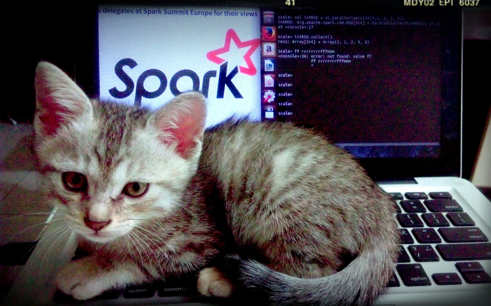

<!-- `xxd` utilitário para visualização de hex; `exiftool` utilitário para visualização de metadados -->

# Information
*Files can always be changed in a secret way. Can you find the flag?*

<figure>
  
  <figcaption>Figura 1: Uma imagem bonitinha de um gatinho no teclado que parecia inofensiva, mas guardava a flag nos metadados.</figcaption>
</figure>

---

Este é o primeiro exercício da trilha de forense digital do **PicoCTF**. Sua proposta consiste na investigação dos metadados do arquivo `cat.jpg` em conjunto à decodificação de uma string em Base64 para revelar a flag.

O desafio é formulado como uma boneca russa (matrioska), isto é, o nível de dificuldade envolve um jogo de raciocínio lógico onde o analista explora em camadas.

## Resolução

No Kali, ao executar a linha de comando

`exiftool cat.jpg`

e obter os metadados do arquivo `cat.jpg`, nota-se o padrão de encoding `(Base64)` conhecido na cadeia de caracteres referente à Licença do arquivo: `"cGljb0NURnt0aGVfbTN0YWRhdGFfMXNfbW9kaWZpZWR9"`.

Decifrando a mensagem com o utilitário nativo do Linux

`echo "cGljb0NURnt0aGVfbTN0YWRhdGFfMXNfbW9kaWZpZWR9" | base64 -d`

Obtém-se a flag `picoCTF{the_m3tadata_1s_modified}`, concluindo a fase com êxito.

>[!TIP]
>O comprimento de uma string codificada em Base64 sempre terá um número total de caracteres múltiplo de 4 e é caracterizada pela alternância constante entre letras maiúsculas, minúsculas e números. Apesar de não ser identificado neste experimento, strings em Base64 podem conter caracteres de preenchimento `(=)` no final. 